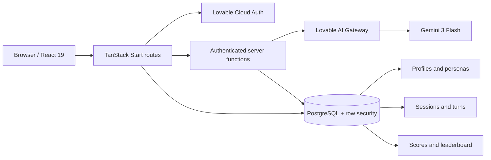
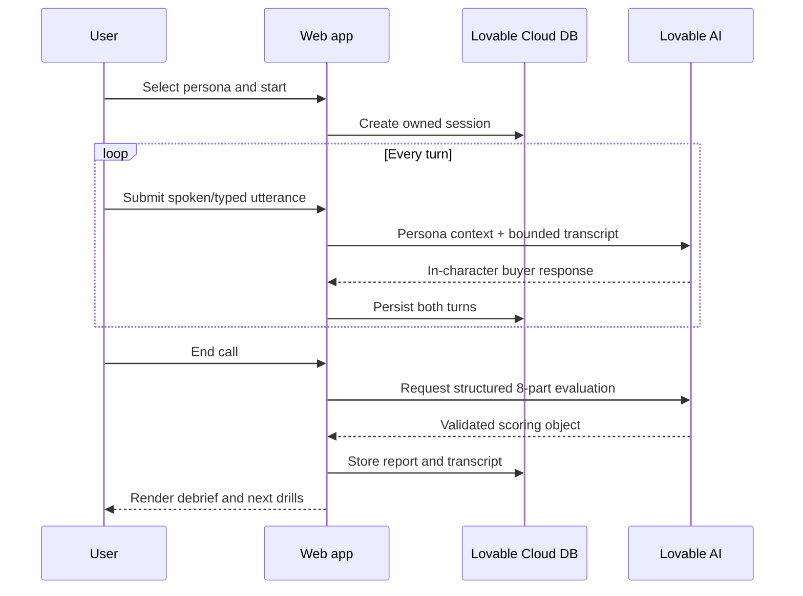
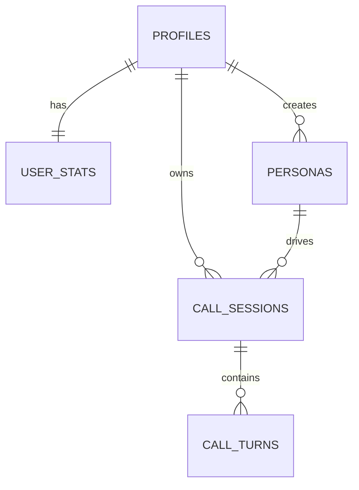

# PitchCoach AI

> Practice cold calls until you stop losing deals.

PitchCoach AI is a voice-ready, AI-native sales practice platform for SDRs, account executives, and founders. It creates the pressure of a real buyer conversation before revenue, reputation, or a fundraise is at risk.

## The problem

Sales professionals make dozens of calls each day but rarely get a structured feedback loop. Traditional training is passive, manager role-play is difficult to schedule, and enterprise call-intelligence products analyze mistakes only after they have happened. Founders face the same problem when learning to pitch investors with actual capital on the line.

PitchCoach moves learning **before the call**. A user picks one of ten psychologically distinct buyers, practices a realistic conversation, and receives an eight-dimension debrief with specific drills.

## How it solves it

- **Real resistance:** personas interrupt, object, become interested, or end weak conversations.
- **Deliberate practice:** repeatable scenarios isolate specific skills without risking a live opportunity.
- **Immediate diagnosis:** every session is scored for opening, talk ratio, objection handling, filler words, value framing, discovery, next step, and confidence.
- **Actionable coaching:** Lovable AI returns one strength, one critical weakness, and three next drills.
- **Persistent progress:** call history, reports, streaks, and an opt-in leaderboard make improvement visible.

## Does it save time and money?

Yes. The product removes scheduling from practice and turns a manager-led 30–60 minute role-play into an on-demand 10-minute drill. A rep can practice before the workday, review feedback immediately, and repeat the exact failure mode.

The free tier replaces ad-hoc peer practice. Pro is priced at **$24.99/month**, far below enterprise conversation-intelligence contracts or a single hour of external sales coaching. The larger economic gain is avoided loss: improving one weak opener or objection response before a real call can preserve an opportunity worth thousands of dollars. PitchCoach does not promise revenue outcomes; it lowers the cost, time, and risk of building the behaviors that drive them.

## Product surfaces

| Surface | Purpose |
|---|---|
| Landing | Positioning, personas, workflow, pricing |
| Authentication | Email/password and managed Google login |
| Onboarding | Role, product, ideal customer, deal size, first drill |
| Dashboard | Practice entry point, scorecard, recent sessions |
| Personas | Ten seeded buyers with tier-aware availability |
| Practice room | Stateful, multi-turn AI role-play with live counters |
| Debrief | Eight scores, transcript-derived feedback, next drills |
| History & analytics | Persistent session record and performance model |
| Leaderboard | Privacy-aware practice ranking |
| Settings | Pitch context and leaderboard consent |

## Architecture



The application is a modular monolith: one deployable web application with explicit browser, server-function, AI, and data boundaries. This is intentionally simpler and safer than the seven-microservice draft in the PRD for an MVP. It avoids operational overhead while preserving seams that can be extracted when traffic or team ownership justifies it.

## Call and scoring sequence



## Data design



Core tables are `profiles`, `personas`, `call_sessions`, `call_turns`, and `user_stats`. Every user-owned table has row-level access policies. Built-in personas are public read-only records; custom personas are private. Leaderboard data is only public for profiles that opt in.

## Security model

- Server-side AI keys never enter the browser bundle.
- Authenticated server functions validate bearer sessions and every input with Zod.
- Database grants and row-level policies enforce ownership even if a client is modified.
- The elevated signup trigger cannot be invoked by anonymous or signed-in clients.
- Passwords are screened against known breach corpora.
- Google login is handled by managed OAuth rather than app-owned secrets.
- Transcript length and turn history are bounded before model invocation.
- Leaderboard visibility is explicit and reversible.

Before a broad launch, add distributed abuse throttling, retention jobs, formal privacy/terms documents, data export/deletion automation, observability alerts, and a voice streaming provider. The current practice transport is text-first and deliberately preserves the architecture boundary for streaming speech-to-text and text-to-speech.

## Runtime stack

- TanStack Start v1, React 19, TypeScript, Vite
- Tailwind CSS v4 and semantic OKLCH design tokens
- Lovable Cloud for authentication and PostgreSQL
- Lovable AI Gateway with AI SDK structured output
- TanStack Query, Recharts, Lucide, shadcn primitives

## Local development

```bash
bun install
bun run dev
```

Environment configuration is provisioned by Lovable Cloud. `LOVABLE_API_KEY` is server-only and must never use a `VITE_` prefix.

## Deployment model

The app targets an edge-compatible server runtime. Route pages are SSR-capable; authenticated mutations and AI calls cross typed server-function boundaries. Generated route metadata is owned by TanStack Router and must not be edited manually.

## Product economics

The architecture scales cost with usage: static and SSR surfaces are inexpensive; the principal variable cost is model inference per turn and per report. Bounded history, short persona responses, structured one-shot scoring, free-tier session caps, and future rate limits protect gross margin. At scale, cache static persona prompts, summarize long transcripts incrementally, and route low-complexity turns to the least expensive acceptable model.

## MVP definition of done

- A new user can register, confirm identity, complete onboarding, and preserve pitch context.
- A signed-in user can select a persona, complete a multi-turn role-play, and receive a persisted AI report.
- Users can revisit their own reports and control leaderboard visibility.
- Unauthenticated users cannot read private calls, turns, profiles, or coaching.
- AI credentials remain server-side and model output is schema-validated.

## Roadmap

1. Streaming microphone capture, speech-to-text, and low-latency TTS.
2. Usage enforcement and Pro/Teams checkout.
3. Automated aggregates, streaks, and weekly debrief emails.
4. Custom persona generation with content safety.
5. Manager workspaces, assignments, and team benchmarks.
6. Native PDF exports, GDPR data export, and deletion cooling-off workflow.

## Operating principle

**Real calls are for execution. PitchCoach is where failure becomes training data.**