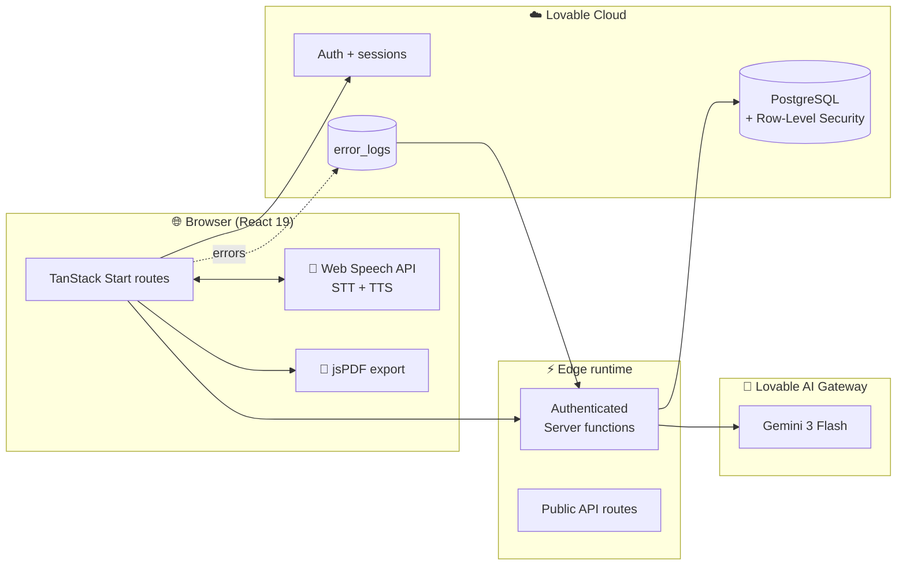
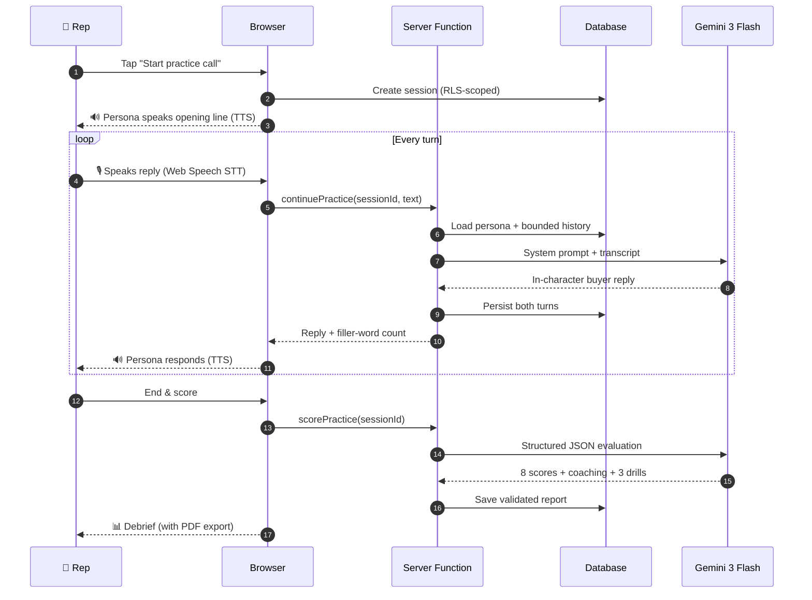
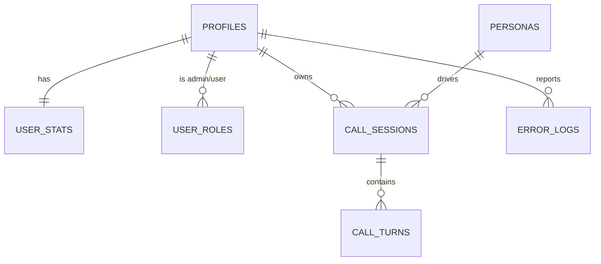

<div align="center">

# 🎯 PitchCoach AI

### **The flight simulator for sales conversations.**

*Practice the call that matters — before it costs you the deal.*

[](https://lovable.dev)
[](https://tanstack.com/start)
[](https://lovable.dev)
[]()

---

**🎤 Voice-in / voice-out** · **🧠 10 buyer personas with attitude** · **📊 8-dimension scorecard** · **📄 PDF debrief export** · **🛡️ Admin monitoring console**

</div>

---

## 🔥 The 30-second pitch

> Sales reps make 40+ calls a day and almost never get coached on a single one. Investor pitches blow up live, in front of the only people who could have written the check. **PitchCoach AI is where you fail safely.**
>
> Pick a buyer persona, take a call, get a 100-point scorecard and the next three drills — in under ten minutes. No scheduling, no managers, no awkward roleplay with a coworker who'd rather be selling.
>
> If you've ever wished there was a "save state" for real conversations, this is it.

---

## ❓ What problem does it actually solve?

| Reality today | What PitchCoach does |
|---|---|
| Reps practice on **real prospects** and lose deals to learn. | They lose them to an **AI buyer** that doesn't have a budget anyway. |
| Manager roleplay = scheduling, ego, inconsistent rubric. | On-demand drills with the **same 8-dimension rubric every time**. |
| Call-recording tools tell you what went wrong **yesterday**. | We tell you **before the call**, so it doesn't go wrong at all. |
| Founders rehearse pitches in the mirror. | They get interrupted by a **Series A CFO** who's heard 200 pitches this year. |
| "Sales training" = a slide deck once a quarter. | Deliberate practice, **measured every rep**, like the gym. |

---

## 💸 Does it save time and money?

**Yes — measurably, in three places.**

1. **Time.** A traditional manager roleplay is a 30–60 minute calendar negotiation. A PitchCoach drill is **10 minutes, on demand, at 6am if you want it**. A rep can complete a full practice + scored debrief in the time it would take to schedule the old kind.
2. **Money — direct.** Pro is **$24.99/month**. The going rate for a one-hour external sales coach is **$200–$500**. Enterprise conversation-intelligence platforms start at **$1,000+/seat/year** and only tell you what already happened.
3. **Money — avoided loss.** One fixed opener or one cleanly handled "your competitor is cheaper" objection on a real call can save a deal worth **thousands**. We don't promise revenue; we lower the cost, time, and risk of building the behaviors that produce it.

**Honest math for a 20-rep team:** replacing two hours of manager roleplay per rep per month with PitchCoach Pro returns ~$960 in saved manager time at a fully-loaded $24/hr — at a software cost of **$500**. The avoided-loss upside is uncapped.

---

## 👀 What you can actually do in the app today

| Surface | What happens |
|---|---|
| **Landing** | Positioning, personas, pricing, public leaderboard preview. |
| **Auth** | Email/password and managed Google sign-in. Breach-screened passwords. |
| **Onboarding** | Capture role, product, ICP, deal size — feeds every future drill. |
| **Dashboard** | Streak, average score, personal best, recent calls. |
| **Personas** | Ten psychologically distinct buyers (Gatekeeper, Price Objector, Series A CFO, Competitor Loyalist, and friends). |
| **🎤 Live Practice** | Real-time **voice in (Web Speech) + voice out (TTS)**, with typing fallback. Live counters for filler words, objections, turns. |
| **Debrief** | 8 scores, transcript-grounded coaching, three concrete next drills. **One-click PDF export.** |
| **History & analytics** | Every call persisted. Trends over time. |
| **Leaderboard** | Opt-in only. Privacy-aware. |
| **🛡️ Admin Console** | User counts, call volume, completion rate, average score, **live error feed with resolve-tracking**. Role-gated. |

---

## 🏗️ Architecture — at a glance



It's a **modular monolith** — one deployable app, with hard boundaries between browser, server functions, AI, and data. Simpler than seven microservices, safer than putting business logic in the browser.

---

## 🎬 The live call loop



---

## 🗂️ Data model



| Table | Purpose | RLS posture |
|---|---|---|
| `profiles` | User-facing identity + onboarding answers | Owner-only |
| `personas` | 10 built-in + custom buyer profiles | Built-ins public-read; custom owner-only |
| `persona_secrets` | System prompts for each persona | Service-role only — never leaks |
| `call_sessions` | One row per practice call | Owner-only |
| `call_turns` | Every line of dialogue | Owner-only |
| `user_stats` | Aggregates, streaks, leaderboard score | Owner-only; opt-in leaderboard read |
| `user_roles` | Admin grants — separate table on purpose | Anti-privilege-escalation pattern |
| `error_logs` | Client errors for the admin console | Insert by anyone; read by admins only |

---

## 🛡️ Security posture

- ✅ AI keys live **server-side only** — never ship to the browser.
- ✅ Every user table protected by **Row-Level Security** scoped to `auth.uid()`.
- ✅ Roles stored in a **separate `user_roles` table** with `SECURITY DEFINER` `has_role()` — no privilege escalation by editing your own profile.
- ✅ Server functions validate every input with **Zod**.
- ✅ Passwords screened against the **HaveIBeenPwned** breach corpus.
- ✅ Google login via **managed OAuth** — no app-owned secrets.
- ✅ Transcript & turn history **bounded** before model calls (cost & prompt-injection control).
- ✅ Leaderboard visibility is **explicit and reversible**.

---

## 📡 Monitoring & alerts

Two layers:

1. **Client-side telemetry** — a global `window.error` + `unhandledrejection` listener writes to `error_logs`. Speech-recognition and AI failures also flow here with structured `source` tags (`speech-recognition`, `mic-start`, `continue-practice`, `score-practice`).
2. **Admin console** — `/admin` shows live totals (users, calls, completion rate, average score) plus an incident feed you can resolve inline. RLS guarantees only role-granted admins see it.

To grant the first admin, run once in the database:

```sql
INSERT INTO public.user_roles (user_id, role)
VALUES ('<your-auth-uid>', 'admin');
```

Then visit `/admin`.

---

## ⚙️ Runtime stack

| Layer | Tech |
|---|---|
| Frontend | **React 19**, TanStack Start v1, Vite 7, TypeScript |
| Styling | Tailwind CSS v4, OKLCH semantic tokens, Barlow Condensed display |
| Data fetching | TanStack Query, TanStack Router |
| Voice | Web Speech API (STT) + SpeechSynthesis (TTS) — zero vendor lock-in |
| Backend | Lovable Cloud (Postgres + Auth), typed server functions |
| AI | Lovable AI Gateway → **Gemini 3 Flash** with AI SDK structured output |
| PDF | jsPDF (client-side, zero server cost) |
| Deployment | Edge-compatible Workers runtime |

---

## 🚀 Local development

```bash
bun install
bun run dev
```

Environment is provisioned by Lovable Cloud. The only server-side secret you'd ever rotate is `LOVABLE_API_KEY` — never prefix it with `VITE_`.

---

## 💰 Unit economics

The architecture scales cost with usage:

- Static + SSR surfaces are nearly free per visit.
- The principal variable cost is **AI inference per turn** and **one structured scoring call per session**.
- Bounded history (last 30 turns), short persona replies (1–3 sentences), structured one-shot scoring, free-tier session caps, and rate limits protect gross margin.
- At scale: cache static persona prompts, summarize long transcripts incrementally, and route low-complexity turns to a cheaper acceptable model.

---

## 🗺️ Roadmap

- [x] Voice-in / voice-out practice (Web Speech)
- [x] PDF debrief export
- [x] Admin monitoring console
- [ ] Streaming low-latency TTS (ElevenLabs / Cartesia)
- [ ] Usage metering + Stripe checkout for Pro/Teams
- [ ] Custom persona generation with content safety
- [ ] Manager workspaces, assignments, team benchmarks
- [ ] Weekly debrief email digest
- [ ] GDPR data export + deletion cooling-off

---

## 🎯 Operating principle

> **Real calls are for execution. PitchCoach is where failure becomes training data.**

---

<div align="center">

**Built with Lovable** · *Practice the hard call here. Make the real one easy.*

</div>